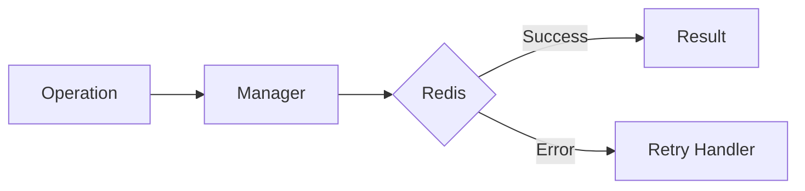

# 13 Retry with Timeout

## Description

Demonstrates limiting total retry time to prevent operations from blocking indefinitely, with different timeout scenarios.



## Code

See `example.py`

## Run

```bash
python example.py
```
