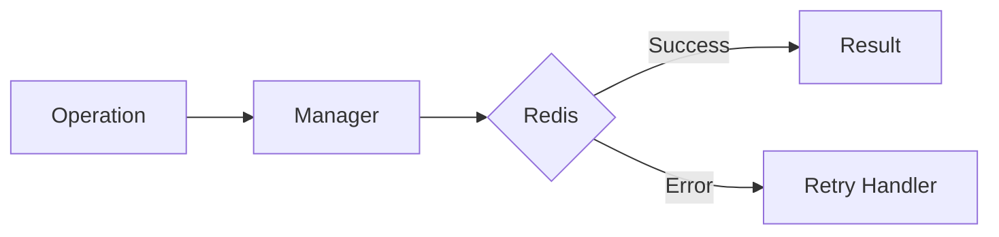

# 14 Async Retry

## Description

Demonstrates using async_retry decorator for async/await functions with automatic retry using asyncio.sleep.



## Code

See `example.py`

## Run

```bash
python example.py
```
