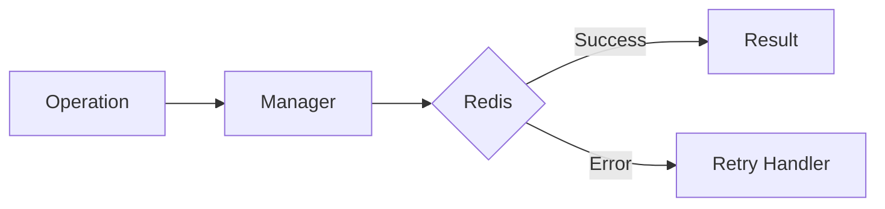

# 15 Async Retry FastAPI

## Description

Demonstrates integrating async_retry with FastAPI endpoints to create resilient APIs that can handle Redis failures gracefully.



## Code

See `example.py`

## Run

```bash
python example.py
```
