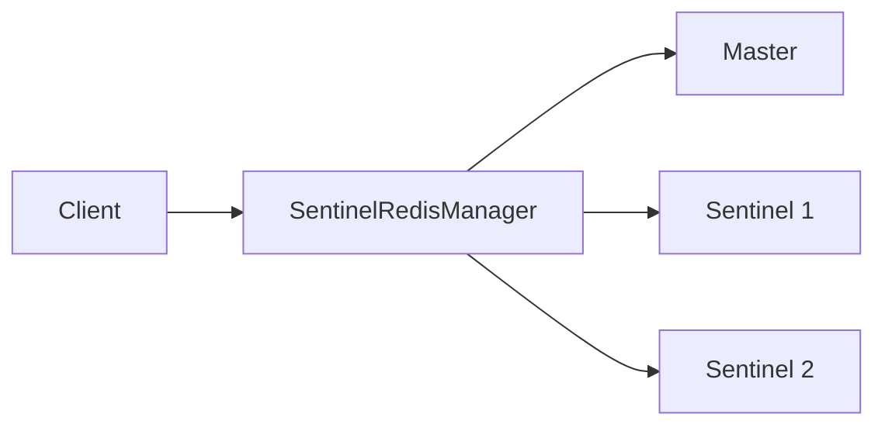

# Sentinel Redis Manager - Basic Example

This example demonstrates how to use the `SentinelRedisManager` to connect to a Redis sentinel setup and perform basic operations.

## Architecture



## Description

The `SentinelRedisManager` manages connections to a Redis sentinel setup, handling:
- Sentinel nodes for service discovery
- Automatic master/slave failover
- Read/write splitting (write to master, read from slave)

## Code

```python
from wredis.ha import SentinelRedisManager

sentinel_nodes = [
    ("localhost", 26379),
    ("localhost", 26380),
    ("localhost", 26381),
]

manager = SentinelRedisManager(
    sentinel_nodes=sentinel_nodes,
    service_name="mymaster",
)

master = manager.get_master()
slave = manager.get_slave()

master.set("key", "value")
value = master.get("key")

print(f"Value from master: {value}")

if slave:
    slave_value = slave.get("key")
    print(f"Value from slave: {slave_value}")
```

## Run Instructions

1. Start Redis sentinel nodes on ports 26379, 26380, 26381
2. Configure sentinel to monitor a master node with service name "mymaster"
3. Run the example:
   ```bash
   python examples/sync/sentinel/01_basic/example.py
   ```
