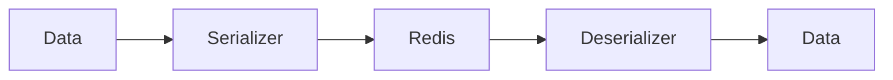

# 01 Basic Serialize

## Description

Demonstrates basic serialization of Python primitive types (integers, floats, strings, booleans) using the wredis serializer.



## Code

See `example.py`

## Run

```bash
python example.py
```