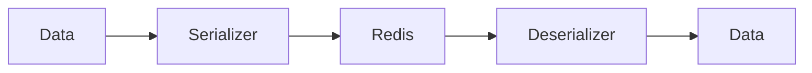

# 02 Nested Dicts

## Description

Demonstrates serialization of nested dictionaries, commonly used for storing complex configurations or user records in Redis.



## Code

See `example.py`

## Run

```bash
python example.py
```