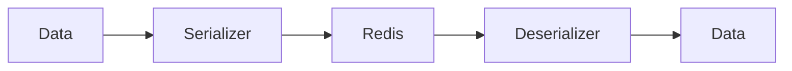

# 03 Lists and Collections

## Description

Demonstrates serialization of lists including simple lists, mixed-type lists, nested lists (matrices), and empty lists.



## Code

See `example.py`

## Run

```bash
python example.py
```