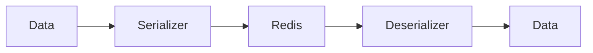

# 04 Unicode Strings

## Description

Demonstrates serialization of Unicode text, emojis, and special characters from various languages.



## Code

See `example.py`

## Run

```bash
python example.py
```