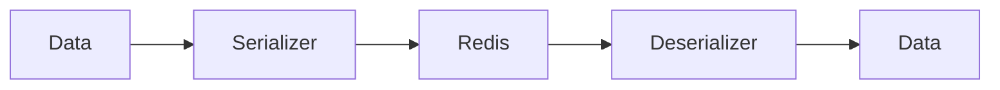

# 05 None Values

## Description

Demonstrates serialization of None values and their behavior in dictionaries and lists.


```mermaid
graph LR
    A[Data] --> B[Serializer]
    B --> C[Redis]
    C --> D[Deserializer]
    D --> E[Data]
```

## Code

See `example.py`

## Run

```bash
python example.py
```