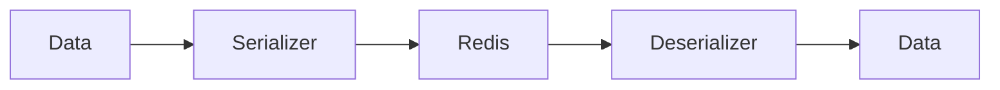

# 07 Datetime Serialization

## Description

Demonstrates serialization of datetime objects by converting them to ISO 8601 strings.



## Code

See `example.py`

## Run

```bash
python example.py
```