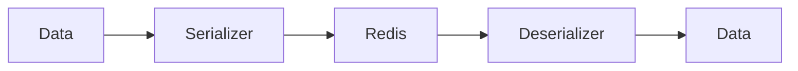

# 08 Custom Objects

## Description

Demonstrates serialization of custom objects (dataclasses) by converting them to dictionaries first.



## Code

See `example.py`

## Run

```bash
python example.py
```
