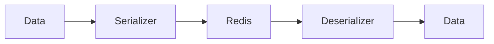

# 10 Round Trip

## Description

Verifies data integrity through round-trip serialization/deserialization cycles for various data types.



## Code

See `example.py`

## Run

```bash
python example.py
```
