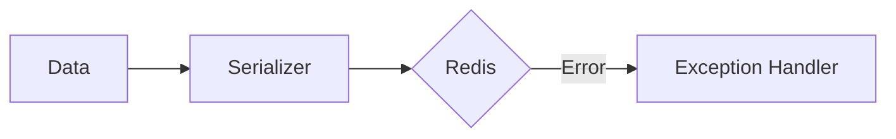

# 11 Error Handling

## Description

Demonstrates handling of SerializationError when attempting to serialize incompatible objects like sets, functions, custom objects, and invalid JSON.



## Code

See `example.py`

## Run

```bash
python example.py
```
