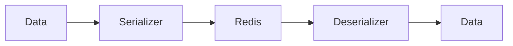

# 12 Tuples to Lists

## Description

Demonstrates how Python tuples are converted to JSON lists during serialization, since JSON doesn't support tuple type.



## Code

See `example.py`

## Run

```bash
python example.py
```