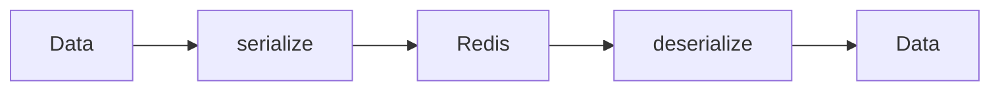

# 14 Redis Storage Pattern

## Description

Demonstrates a common pattern where data is serialized before storing in Redis and deserialized when retrieving, simulating real Redis usage.



## Code

See `example.py`

## Run

```bash
python example.py
```