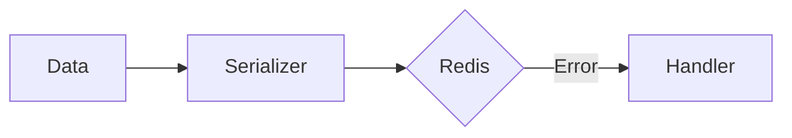

# 15 Error Handling Advanced

## Description

Demonstrates advanced error handling techniques for serialization including safe wrapper functions with fallback and prior validation of data.



## Code

See `example.py`

## Run

```bash
python example.py
```