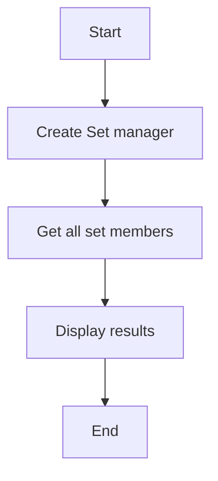

# Sets Read Example

## Description

This example demonstrates reading members from a Redis set using `RedisSetManager`.

## Diagram



## Code

```python
from wredis.sets import RedisSetManager

set_manager = RedisSetManager(host="localhost")


print(set_manager.get_set_members("my_set"))
```

## Run Instructions

```bash
python example.py
```
