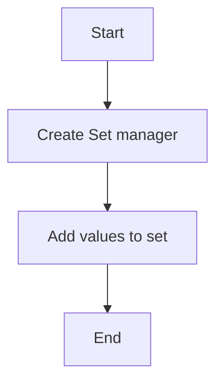

# Sets Create Example

## Description

This example demonstrates creating a Redis set by adding members using `RedisSetManager`.

## Diagram



## Code

```python
from wredis.sets import RedisSetManager

set_manager = RedisSetManager(host="localhost")

set_manager.add_to_set("my_set", "value1", "value2")
set_manager.add_to_set("my_set", "value5", "value2")
set_manager.add_to_set("my_set", "value1", "value8")
```

## Run Instructions

```bash
python example.py
```
