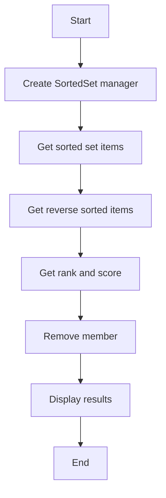

# Sorted Set Read Example

## Description

This example demonstrates reading from a Redis sorted set using `RedisSortedSetManager`.

## Diagram



## Code

```python
from wredis.sortedset import RedisSortedSetManager

sorted_set_manager = RedisSortedSetManager(host="localhost")


items = sorted_set_manager.get_sorted_set("my_sorted_set", with_scores=True)
items_reverse = sorted_set_manager.get_sorted_set_reverse("my_sorted_set")
rank = sorted_set_manager.get_rank("my_sorted_set", "item1")
score = sorted_set_manager.get_score("my_sorted_set", "item2")

sorted_set_manager.remove_from_sorted_set("my_sorted_set", "item1")


print(items)
print(items_reverse)
print(rank)
print(score)
```

## Run Instructions

```bash
python example.py
```
