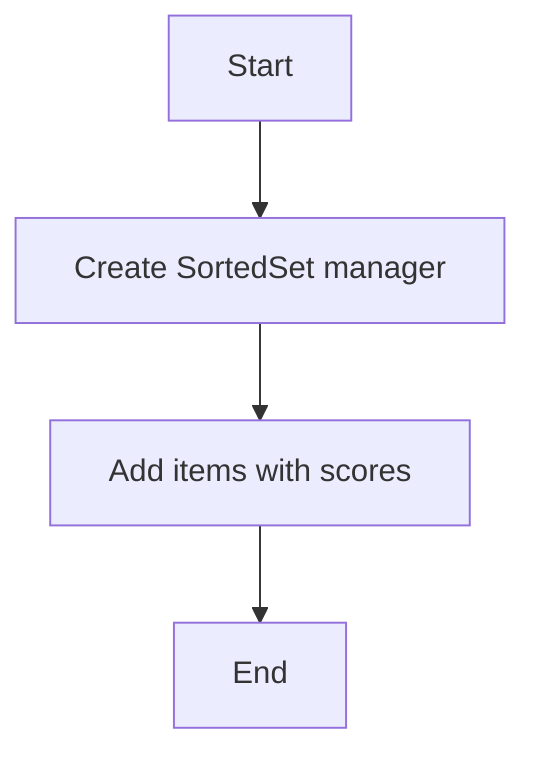

# Sorted Set Create Example

## Description

This example demonstrates creating a Redis sorted set by adding members with scores using `RedisSortedSetManager`.

## Diagram



## Code

```python
from wredis.sortedset import RedisSortedSetManager

sorted_set_manager = RedisSortedSetManager(host="localhost", verbose=False)

sorted_set_manager.add_to_sorted_set("my_sorted_set", 1, "item1")
sorted_set_manager.add_to_sorted_set("my_sorted_set", 3, "item3")
sorted_set_manager.add_to_sorted_set("my_sorted_set", 2, "item2")

sorted_set_manager.add_to_sorted_set("my_sorted_set", 1, "item1")
sorted_set_manager.add_to_sorted_set(key="my_sorted_set", score=5, member="item5")
```

## Run Instructions

```bash
python example.py
```
