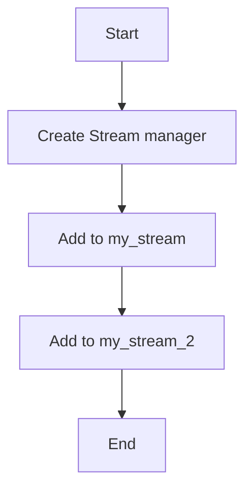

# Streams Producer Example

## Description

This example demonstrates producing messages to Redis streams using `RedisStreamManager`.

## Diagram



## Code

```python
from wredis.streams import RedisStreamManager

stream_manager = RedisStreamManager(host="localhost")

stream_manager.add_to_stream("my_stream", {"field1": "value1"})
stream_manager.add_to_stream("my_stream", {"field2": "value3", "field4": "value4"})


stream_manager.add_to_stream("my_stream_2", {"field1": "value1"})
```

## Run Instructions

```bash
python example.py
```
