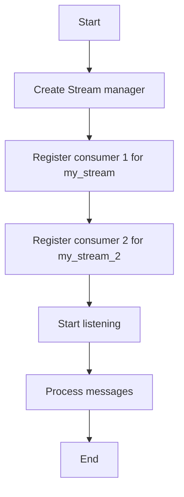

# Streams Consumer Example

## Description

This example demonstrates consuming messages from Redis streams using consumer groups with `RedisStreamManager`.

## Diagram



## Code

```python
from wredis.streams import RedisStreamManager

stream_manager = RedisStreamManager(host="localhost", verbose=False)


@stream_manager.on_message(
    stream_name="my_stream", group_name="my_group", consumer_name="consumer_1"
)
def process_message(data):
    print(f"[Consumer 1] Processing message: {data}")


@stream_manager.on_message(
    stream_name="my_stream_2", group_name="my_group", consumer_name="consumer_2"
)
def process_message_consumer_2(data):
    print(f"[Consumer 2] Processing message: {data}")


stream_manager.wait()
```

## Run Instructions

```bash
python example.py
```

Press Ctrl+C to stop.
