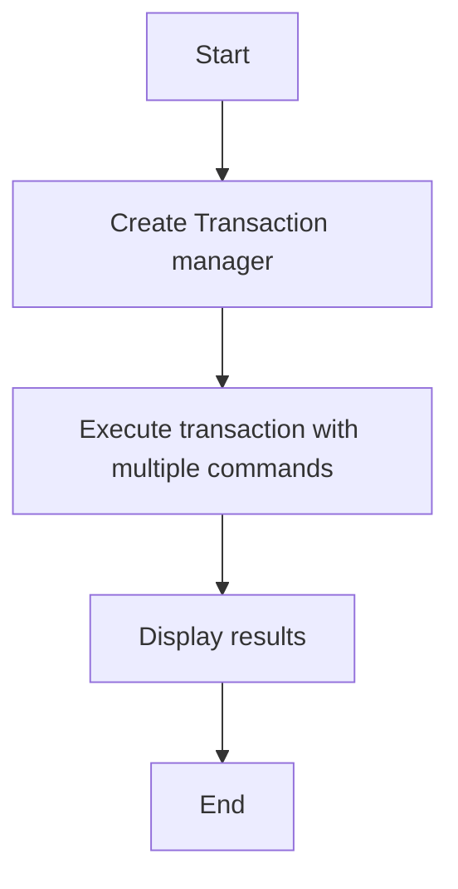

# Transaction Basic Example

## Description

This example demonstrates executing Redis transactions using `RedisTransactionManager`. Transactions allow executing multiple commands atomically.

## Diagram



## Code

```python
from wredis.transaction import RedisTransactionManager

txn = RedisTransactionManager(host="localhost")

results = txn.execute_transaction(
    [
        ("set", ["balance:alice", "100"]),
        ("set", ["balance:bob", "50"]),
        ("incrby", ["balance:alice", 50]),
        ("get", ["balance:alice"]),
    ]
)
print(f"Transaction results: {results}")
```

## Run Instructions

```bash
python example.py
```
