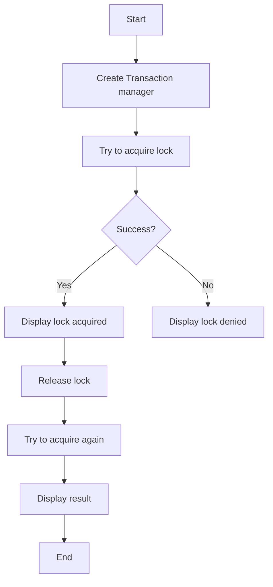

# Transaction Lock Example

## Description

This example demonstrates using distributed locks with Redis transactions using `RedisTransactionManager`.

## Diagram



## Code

```python
from wredis.transaction import RedisTransactionManager

txn = RedisTransactionManager(host="localhost")

set_result = txn.set_if_not_exists("lock:process_1", "locked", ttl=60)
print(f"Lock acquired: {set_result}")

set_result_2 = txn.set_if_not_exists("lock:process_1", "locked_again", ttl=60)
print(f"Second lock attempt: {set_result_2}")

txn.redis_client.delete("lock:process_1")

set_result_3 = txn.set_if_not_exists("lock:process_1", "locked", ttl=60)
print(f"After delete, lock: {set_result_3}")
```

## Run Instructions

```bash
python example.py
```
