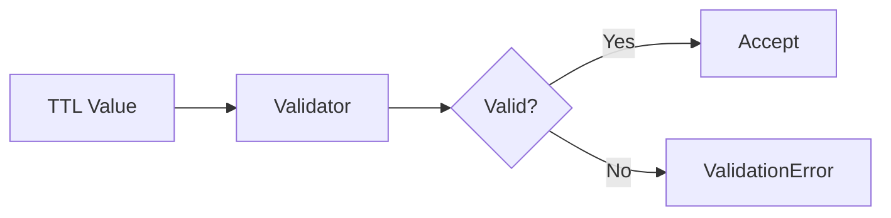

# 01 TTL Validation

## Description

Demonstrates basic TTL validation with acceptable values (positive, zero, and -1 for no expiration).



## Code

See `example.py`

## Run

```bash
python example.py
```
