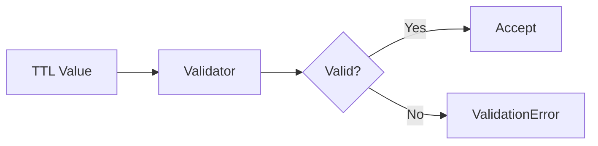

# 02 Invalid TTL

## Description

Demonstrates that TTL values less than -1 raise ValidationError, as these are invalid TTL values.



## Code

See `example.py`

## Run

```bash
python example.py
```
