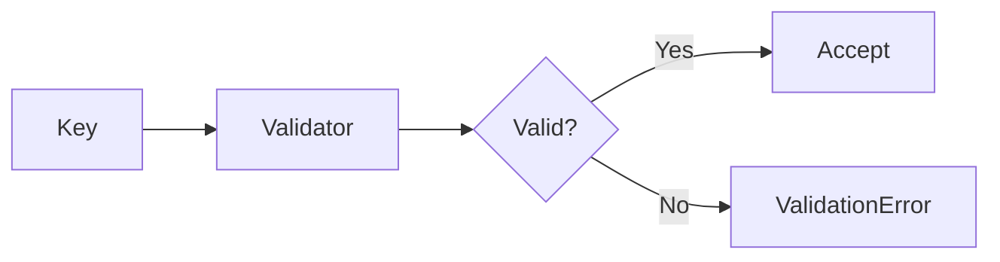

# 03 Key Validation

## Description

Demonstrates basic Redis key validation with valid cases including simple keys, hierarchical keys, keys with special characters, and edge cases at boundaries.



## Code

See `example.py`

## Run

```bash
python example.py
```