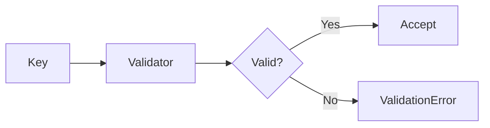

# 04 Invalid Key

## Description

Demonstrates that empty keys and keys larger than 512 characters raise ValidationError.


```mermaid
graph LR
    A[Key] --> B[Validator]
    B --> C{Valid?}
    C -->|Yes| D[Accept]
    C -->|No| E[ValidationError]
```

## Code

See `example.py`

## Run

```bash
python example.py
```
