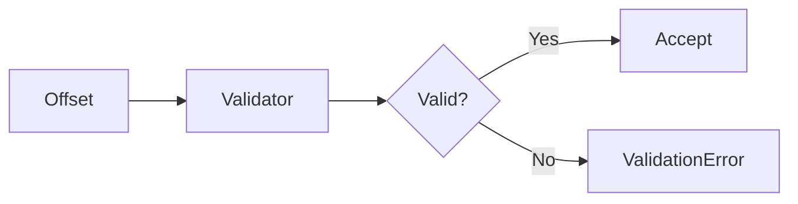

# 05 Offset Validation

## Description

Demonstrates offset validation for bitmap operations, showing valid offsets (0, positive numbers) and invalid negative offsets.



## Code

See `example.py`

## Run

```bash
python example.py
```