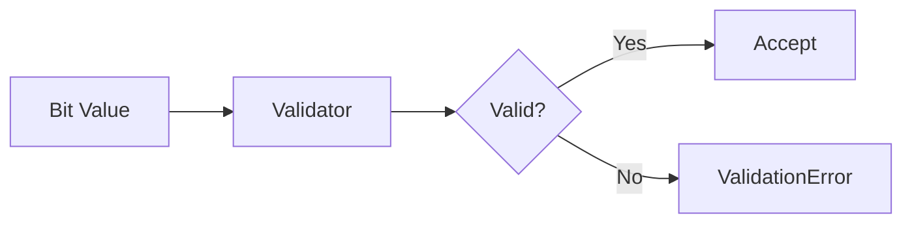

# 06 Bit Value Validation

## Description

Demonstrates bit value validation for SETBIT/GETBIT operations, showing that only 0 and 1 are valid values.



## Code

See `example.py`

## Run

```bash
python example.py
```