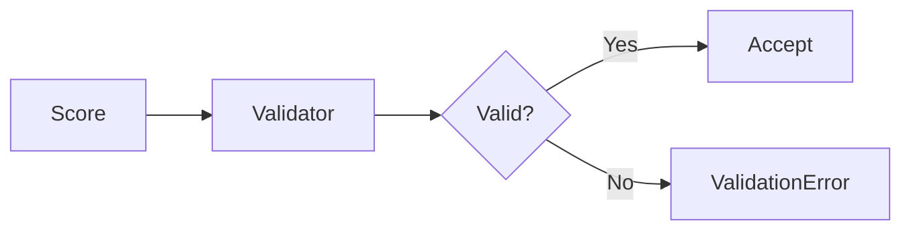

# 07 Score Validation

## Description

Demonstrates score validation for sorted sets, showing valid scores (integers, floats, negative) and invalid scores (NaN, infinity).



## Code

See `example.py`

## Run

```bash
python example.py
```
