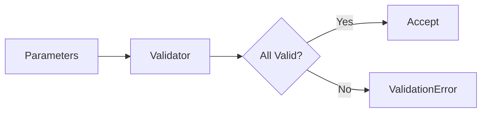

# 08 Batch Validation

## Description

Demonstrates batch validation of multiple parameters for operations like bitmaps, validating key, offset, and bit_value together.



## Code

See `example.py`

## Run

```bash
python example.py
```
