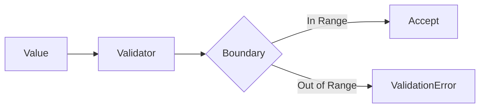

# 09 Edge Cases

## Description

Demonstrates edge case validation for all validation functions, testing boundary limits for TTL, keys, offsets, bit values, and scores.



## Code

See `example.py`

## Run

```bash
python example.py
```