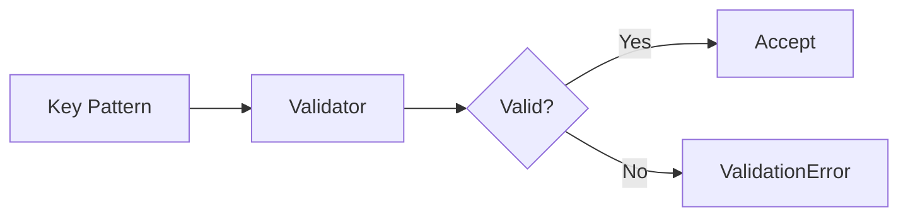

# 10 Key Patterns

## Description

Demonstrates validation of various common Redis key naming patterns including entity:id, hierarchical, cache, queue, counters, locks, and configurations.



## Code

See `example.py`

## Run

```bash
python example.py
```
