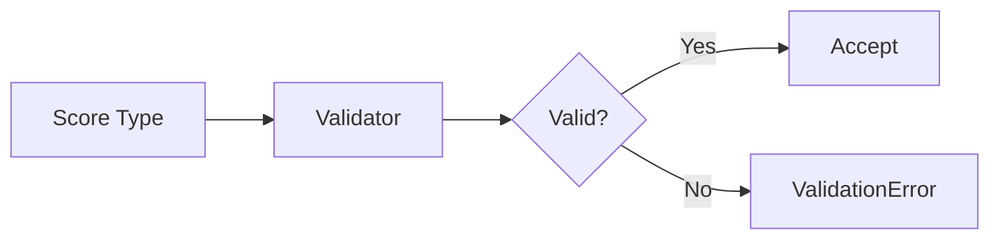

# 11 Score Types

## Description

Demonstrates score validation with different Python numeric types (int, float, bool) and validates that invalid types (string, None, list) raise ValidationError.



## Code

See `example.py`

## Run

```bash
python example.py
```