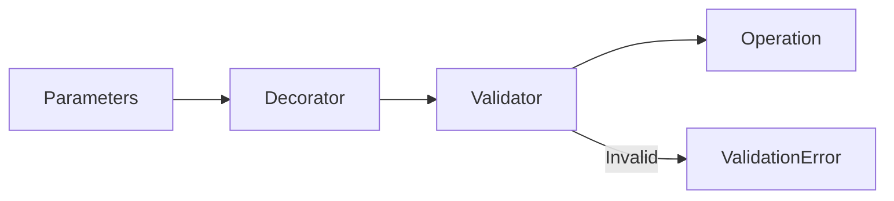

# 12 Validation Decorator

## Description

Demonstrates creating a reusable decorator that automatically validates key and TTL parameters before executing operations.



## Code

See `example.py`

## Run

```bash
python example.py
```
