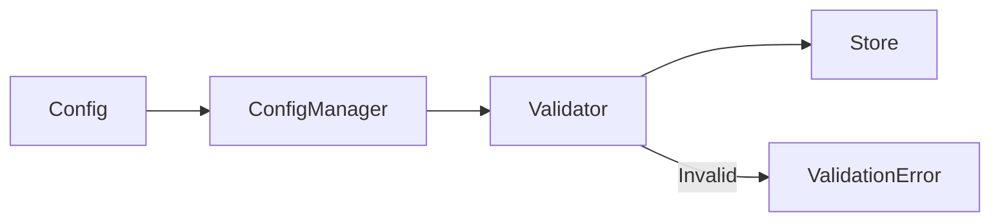

# 13 Config Manager

## Description

Demonstrates integrating validation into a configuration manager class that validates keys and TTL before storing or retrieving configurations.



## Code

See `example.py`

## Run

```bash
python example.py
```
