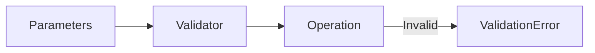

# 14 Bitmap Operations

## Description

Demonstrates complete validation of parameters (key, offset, bit_value) for bitmap operations like SETBIT/GETBIT.



## Code

See `example.py`

## Run

```bash
python example.py
```
