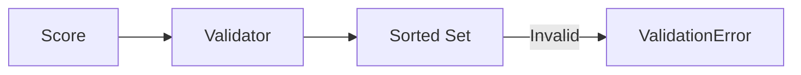

# 15 Sorted Set Scores

## Description

Demonstrates score validation for sorted set operations (ZADD) including valid scores (positive, negative, float, zero) and invalid scores (NaN, infinity, string).



## Code

See `example.py`

## Run

```bash
python example.py
```
